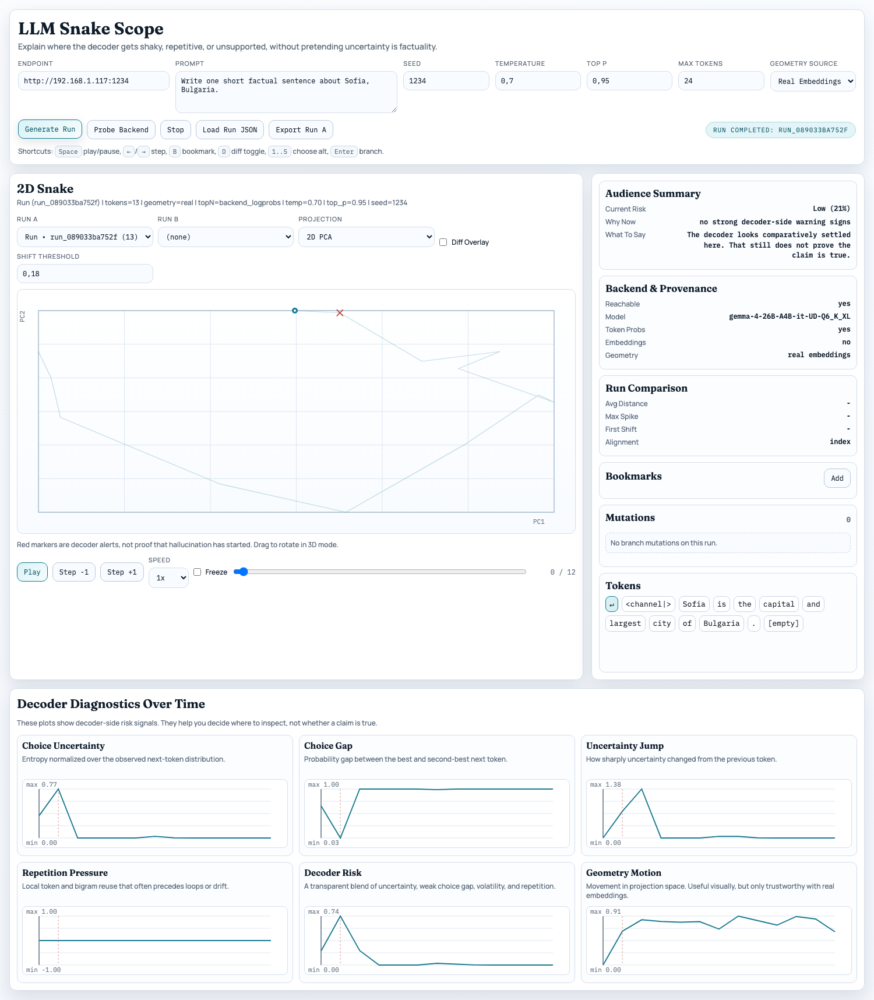
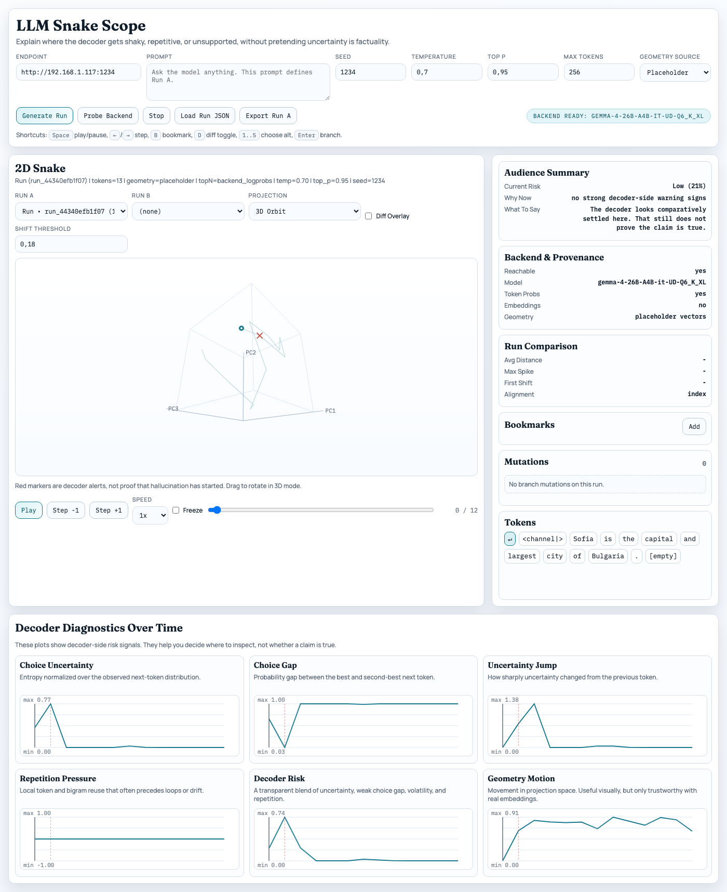

# LLM Snake Scope (2D)

A local analyst-focused visualizer for autoregressive runs.

This version is intentionally **2D + time-first**:
- stable PCA projection of token vectors
- optional 3D orbit view for the same runs
- replay controls and freeze frame
- run-vs-run diff with alignment + delta summary
- decoder alert markers
- clickable token inspection (top-N alternatives)
- token branching and regeneration
- backend probing and provenance display

## Quick Start

1. Start your inference backend (llama.cpp-compatible HTTP API).
   - It should expose `/completion`.
   - For best token alternatives, enable `n_probs` support.
   - Optional: expose `/embedding` for real vectors.

2. Start the visualizer server:

```bash
./viz_server.sh start
```

3. Open:

```text
http://127.0.0.1:18765
```

4. Enter endpoint + prompt and click **Generate Run**.

## Controls

- `Space`: play / pause
- `Left` / `Right`: step timeline
- `B`: bookmark current token index
- `D`: toggle diff overlay
- Drag in `3D Orbit`: rotate the projection
- Click token: open alternatives popup
- `1..5`: choose alternative token in popup
- `Enter`: confirm branch generation

## What Changed vs Earlier Versions

- Replaced the old camera-heavy 3D workflow with a cleaner 2D default plus an optional 3D orbit mode.
- Added deterministic PCA projection with cached coordinates.
- Added run management (`Run A`, `Run B`), diff overlay, and alignment summary.
- Added per-token chips with top-N alternatives and branch regeneration.
- Reframed the time-series panels around decoder diagnostics: uncertainty, choice gap, uncertainty jump, repetition pressure, decoder risk, and geometry motion.
- Added plain-language summary panels and backend/provenance checks.
- Added an experimental `Live Branch Lab` subpage for baseline-vs-corrected decoder-risk intervention runs.
- Added a claim-level harness path in `Live Branch Lab`: check-worthy claim extraction, targeted factual probes, consistency-based claim risk, and branch acceptance that requires more than raw decoder-risk improvement.

## Implemented on 2026-04-18

The current repo now includes the decoder-diagnostics rewrite described above.

- Added `Probe Backend` and backend provenance so the UI shows whether token probabilities and embeddings are really available.
- Added plain-language summaries (`Current Risk`, `Why Now`, `What To Say`) next to the plots.
- Replaced the old metric stack with decoder-side diagnostics: uncertainty, choice gap, uncertainty jump, repetition pressure, decoder risk, and geometry motion.
- Restored 3D as an optional orbit mode instead of the main workflow.
- Fixed geometry provenance so a run requested with `real` embeddings falls back and displays `placeholder vectors` when the backend does not actually expose `/embedding`.
- Saved the next project backlog in [docs/NEXT_STEPS.md](docs/NEXT_STEPS.md).
- Added a separate `Live Branch Lab` page that runs baseline vs corrected decode and links the resulting runs back into the main visualizer.
- Added live-ish incremental updates for `Live Branch Lab` via SSE so the page shows baseline/corrected progress before the final response returns.
- Clarified the no-intervention case in `Live Branch Lab`: when no branch is accepted, the second run is labeled as a replay sample rather than being presented as a successful correction.
- Updated handoff into `Snake Scope` so it opens on the max-risk token and distinguishes `Current Token Risk` from `Run Max Risk`.
- Replaced the Lab's plain text output blocks with readable inline token rendering, peak-risk token highlighting, and per-token hover telemetry.
- Added a first claim-level harness in `Live Branch Lab`: claim-boundary selection, check-worthy filtering, targeted factual probes, consistency scoring, and a second acceptance gate that requires claim-risk improvement as well as decoder-risk improvement.
- Added a local research corpus under [docs/research](docs/research) with downloaded papers, raw notes, and vendored code snapshots from the papers we borrowed methodology from.
- Pruned [docs/NEXT_STEPS.md](docs/NEXT_STEPS.md) so it contains only active lab work and no non-research backlog filler.
- Measured the current latency envelope on a fixed `max_tokens=18` / single-intervention benchmark:
  - backend mean completion time: about `4.08s` before SSE vs `4.12s` after SSE
  - first visible UI update: about `4.07s` before SSE vs `0.08s` after SSE
  - first visible token text: about `0.23s` after SSE
- Measured the first black-box harness pass on the fake-monograph workload:
  - initial claim-harness loop: about `354s` on `max_tokens=96`
  - after claim-level dedupe: about `155s` on `max_tokens=64`
  - implication: the claim harness is useful evidence, but still too expensive to treat as a free always-on pass

## Visual Evidence

### 2D Main View

This capture shows the plain-language summary, backend/provenance panel, run comparison panel, and the decoder diagnostics.



### 3D Orbit Mode

This capture shows the optional 3D orbit projection for the same run family.



## Live Branch Lab

An experimental second page is now available at `./live.html`.

What it does:
- runs a baseline decode and a corrected decode with the same prompt/settings
- watches decoder-risk token-by-token
- when the risk stays high long enough, it replays from an earlier prefix and evaluates a few alternative next-token branches
- isolates a check-worthy claim near the risky region, asks targeted factual probes about it, and scores consistency across the answers
- chooses a lower-risk branch only if the measured reduction is large enough and the claim-level harness score also improves
- renders the generated text as inline tokens, highlights the peak-risk token, and exposes token telemetry on hover
- renders claim-level evidence cards so the current risky claim, label, and probe findings are visible next to the decode result

Current limitation:
- this is a `prefix_replay` intervention, not exact KV-state rollback
- lower decoder risk after branching is useful evidence, but it is not proof of factual correctness
- the current claim harness is still black-box and slow; on a realistic fake-reference workload it adds minutes, not milliseconds
- if no intervention fires, the second run should be read as a matched replay sample rather than as evidence of successful correction

The repeatable evaluation plan for this page lives in [docs/LIVE_BRANCH_EVAL.md](docs/LIVE_BRANCH_EVAL.md).

## Research Corpus

The local research artifacts behind the current project pivot live in [docs/research](docs/research).

That directory now contains:
- a survey memo with method-by-method borrowing notes: [docs/research/2026-04-18-harness-survey.md](docs/research/2026-04-18-harness-survey.md)
- downloaded PDF copies of the papers we relied on: [docs/research/papers](docs/research/papers)
- vendored snapshots of public code released with relevant papers: [docs/research/code](docs/research/code)
- raw extraction notes used while comparing the papers against this codebase: [docs/research/notes/paper_extracts.txt](docs/research/notes/paper_extracts.txt)

## Research Recalibration (2026-04-17)

This project originally leaned on a stronger hypothesis than the current literature supports:

- abrupt changes in entropy, logit margin, vector velocity, or curvature might reveal the point where the model "starts hallucinating"

After reviewing recent peer-reviewed work, we no longer treat that as a calibrated claim.

What we now believe:
- single-pass token-level uncertainty signals (`entropy`, `logprob`, `margin`, `top-k mass`) contain useful uncertainty information, but are not strong enough on their own to reliably separate factual from non-factual generation
- semantic uncertainty across multiple sampled continuations is more informative than raw token entropy alone
- claim-level or span-level factuality is a better target than generic token anomaly detection
- if white-box access is available, cross-layer, hidden-state, and attention-derived features are more promising than final-layer-only telemetry
- broad hallucination detectors can fail out of distribution, so calibration and OOD validation matter as much as the detector itself

Operational consequence for this tool:
- the current charts should be read as uncertainty / instability diagnostics
- `regime_markers` are investigation cues, not factuality labels
- `velocity` and `curvature` are especially easy to over-interpret when the run uses placeholder vectors instead of real embeddings

Second correction made on `2026-04-18`:
- when risk crosses a threshold, do not ask a single generic question like "are you sure?"
- use telemetry as a trigger, then stop at a check-worthy claim boundary
- ask targeted factual probes about the risky claim and score internal consistency
- only accept a rewritten branch when the claim-level evidence improves, not only when decoder-risk falls

Evidence base behind this correction and the later harness pivot:
- Agrawal et al., EACL Findings 2024, "Do Language Models Know When They're Hallucinating References?":
  https://aclanthology.org/2024.findings-eacl.62/
- Kuhn et al., Nature 2024, "Detecting hallucinations in large language models using semantic entropy":
  https://www.nature.com/articles/s41586-024-07421-0
- Liang et al., KnowledgeNLP 2024, "Learning to Trust Your Feelings":
  https://aclanthology.org/2024.knowledgenlp-1.4/
- Li et al., NAACL Findings 2025, "HALLUCANA: Fixing LLM Hallucination with A Canary Lookahead":
  https://aclanthology.org/2025.findings-naacl.12/
- Wu et al., NAACL Findings 2025, "Improve Decoding Factuality by Token-wise Cross Layer Entropy of Large Language Models":
  https://aclanthology.org/2025.findings-naacl.217/
- Liu et al., ACL Findings 2025, "Long-form Hallucination Detection with Self-elicitation":
  https://aclanthology.org/2025.findings-acl.211/
- Qin et al., ACL 2025, "Learning Auxiliary Tasks Improves Reference-Free Hallucination Detection in Open-Domain Long-Form Generation":
  https://aclanthology.org/2025.acl-short.93/
- Gupta et al., IJCNLP Findings 2025, "Consistency Is the Key":
  https://aclanthology.org/2025.findings-ijcnlp.129/
- Han et al., EMNLP Findings 2025, "Simple Factuality Probes Detect Hallucinations in Long-Form Natural Language Generation":
  https://aclanthology.org/2025.findings-emnlp.880/
- Kim et al., EMNLP 2025, "Detecting LLM Hallucination Through Layer-wise Information Deficiency":
  https://aclanthology.org/2025.emnlp-main.1644/
- Dubanowska et al., EMNLP Findings 2025, "Representation-based Broad Hallucination Detectors Fail to Generalize Out of Distribution":
  https://aclanthology.org/2025.findings-emnlp.952/
- Kulkarni et al., EMNLP Findings 2025, "Evaluating Evaluation Metrics - The Mirage of Hallucination Detection":
  https://aclanthology.org/2025.findings-emnlp.1035/
- Azaria and Mitchell 2023, "The Internal State of an LLM Knows When It's Lying":
  https://arxiv.org/abs/2304.13734

## Roadmap Toward Better Hallucination-Onset Detection

The goal is no longer "entropy spike means hallucination started here".
The goal is:

- estimate where the output becomes unsupported or confabulatory
- attach an explicit confidence score to that estimate
- make the estimate inspectable against evidence, not only against telemetry

What current science suggests is a more adequate direction:
- combine token-level uncertainty with claim-level / span-level factuality analysis
- prefer semantic uncertainty over multiple sampled continuations over single-pass entropy alone
- add retrieval or evidence-grounded verification so the UI can distinguish "uncertain" from "unsupported"
- when model internals are available, add cross-layer, hidden-state, and attention-derived features
- validate on human-aligned factuality labels and OOD settings, not only on in-domain heuristics

Planned expansion path:

### Phase 0: Make the Current Instrument Honest

- expose whether each run used real embeddings or placeholder vectors
- surface backend capability flags (`n_probs`, embeddings, strict token forcing support) in the UI and exported JSON
- label `regime_markers` explicitly as anomaly markers, not hallucination markers
- log additional decoder-side signals that are cheap and honest: repetition rates, stop reasons, sampled-vs-greedy path, top-k mass, entropy slope

### Phase 1: Add Black-Box Factuality Probes

- harden the current claim/span harness with better boundary detection, de-contextualization, and key-fact extraction
- branch the same prefix into multiple stochastic continuations and compute semantic uncertainty around the next claim/span
- add retrieval-backed evidence checks for extracted claims
- render "supported / unsupported / unknown" overlays next to the current telemetry plots

### Phase 2: Add White-Box Research Mode

- capture cross-layer entropy or information-deficiency style features
- log hidden-state probes and attention/context-allocation signals around suspected onset regions
- compare onset estimates from final-layer telemetry versus multi-layer features
- measure whether white-box signals provide earlier and better-calibrated warnings than `entropy` / `margin` alone

### Phase 3: Calibrate the Detector

- build a labeled evaluation set where annotators mark the earliest unsupported claim/span
- train or calibrate a probabilistic onset score instead of showing only heuristic spikes
- report proper evaluation metrics such as AUROC, F1, ECE, lead time, and OOD degradation
- keep the visualizer usable as a microscope even when the detector is uncertain

## Run JSON Schema (Expected Format)

The app accepts and emits this schema (version `2.0`):

```json
{
  "schema_version": "2.0",
  "run_id": "run_abc123",
  "meta": {
    "label": "Run",
    "prompt": "...",
    "prompt_hash": "...",
    "timestamp": "2026-02-14T12:00:00+00:00",
    "base_url": "http://127.0.0.1:8080",
    "model": "...",
    "status": "complete",
    "generation_settings": {
      "max_tokens": 256,
      "chunk_size": 16,
      "top_n": 5,
      "n_probs": 20,
      "temperature": 0.7,
      "top_p": 0.95,
      "seed": 1234,
      "vector_mode": "placeholder",
      "vector_dim": 24
    },
    "branch": {
      "parent_run_id": "run_parent",
      "fork_index": 42,
      "chosen_alt_token": {
        "token_id": 123,
        "token_text": " alternative",
        "logprob": -2.11,
        "prob": 0.12
      },
      "forcing_strategy": "append_prefix_fallback",
      "timestamp": "2026-02-14T12:05:00+00:00"
    }
  },
  "tokens": [
    {
      "index": 0,
      "t": 12,
      "text": "Hello",
      "chosen_token_id": 123,
      "chosen_token_text": "Hello",
      "logprob": -0.03,
      "prob": 0.97,
      "entropy": 0.45,
      "margin": 3.2,
      "uncertainty": 0.31,
      "prob_gap": 0.64,
      "entropy_delta": 0.08,
      "repetition_pressure": 0.0,
      "decoder_risk": 0.22,
      "velocity": 0.0,
      "curvature": null,
      "embedding": [0.11, -0.05, 0.2, "..."],
      "topN": [
        {"token_id": 123, "token_text": "Hello", "logprob": -0.03, "prob": 0.97},
        {"token_id": 998, "token_text": "Hi", "logprob": -3.1, "prob": 0.045}
      ]
    }
  ],
  "analysis": {
    "decoder_alerts": [
      {"index": 42, "risk": 0.71, "reasons": ["high_uncertainty", "weak_choice_gap"]}
    ],
    "regime_markers": [
      {"index": 42, "reasons": ["velocity_spike", "entropy_slope_spike"]}
    ]
  },
  "summary": {
    "token_count": 256,
    "entropy_avg": 1.33,
    "velocity_max": 0.82,
    "decoder_risk_max": 0.71,
    "decoder_alert_count": 3,
    "duration_ms": 8120
  },
  "bookmarks": [
    {"index": 42, "label": "tone shift", "timestamp": "2026-02-14T12:06:00+00:00"}
  ]
}
```

## Loading Two Runs for Diff Mode

1. Generate runs from the UI, and/or load run JSON via **Load Run JSON**.
2. Select runs in **Run A** and **Run B** dropdowns.
3. Enable **Diff Overlay**.
4. Read the summary panel:
   - average aligned distance
   - max distance spike
   - first shift candidate over threshold

### Alignment Strategy

- If lengths match: index-to-index alignment.
- If lengths differ: monotonic sliding-window nearest-neighbor alignment in projected 2D space.

## Token Branching

### How to Trigger

1. Click a token chip in the token panel.
2. Choose an alternative token (mouse or keys `1..5`).
3. Press **Create Branch** or `Enter`.

### Backend Requirements

Preferred:
- `/completion` returns per-token probability data (`n_probs` / top-logprobs style).

Fallback behavior when detailed alternatives are unavailable:
- deterministic approximation for top-N alternatives.

### Branch Regeneration Strategy

Current implementation uses a deterministic, backend-compatible fallback:
1. Keep original prompt + original token prefix up to `i-1`.
2. Append chosen alternative token `i` to that prefix.
3. Continue generation from `i+1` onward with same generation settings.

Branch metadata is persisted in `meta.branch`.

## API Endpoints

- `GET /api/status`
- `GET /api/runs`
- `GET /api/run/<run_id>`
- `POST /api/generate` (alias: `/api/start`)
- `POST /api/branch`
- `POST /api/stop`
- `POST /api/import-run`
- `GET /stream` (SSE run events)

## Design Notes

### Projection Choice

- High-dimensional vectors are projected to 2D with deterministic PCA.
- Optional `3D Orbit` mode projects the same run set into PCA-3 and allows interactive rotation.
- In single-run mode: PCA fitted on Run A.
- In diff mode: PCA fitted on concatenated vectors from Run A + Run B, so both trajectories share one coordinate frame.
- Projection output is cached by `(run ids + token lengths)` for smooth replay.

### Regime Detection Heuristic

Markers are generated from token-index series:
- embedding velocity spikes (`||v[i]-v[i-1]||`)
- entropy slope spikes (`|H[i]-H[i-1]|`)

Thresholds use a simple `mean + 2*std` rule with a minimum index gap to avoid marker spam.

These markers are currently heuristic anomaly indicators only.
They should not be interpreted as a calibrated answer to "hallucination started here".

### Decoder Diagnostics

The primary decoder-side signals are now:
- normalized next-token uncertainty
- probability gap between the top two token choices
- uncertainty jump from the previous token
- repetition pressure from recent local token reuse
- transparent decoder-risk blend over the above signals

These are still decoder-side heuristics, not claim-level factuality checks.

### Branch Forcing Approach

- Uses append-prefix continuation fallback for broad backend compatibility.
- Keeps settings deterministic (`seed`, `temperature`, `top_p`, etc.) from the parent run.
- Stores branch lineage (`parent_run_id`, `fork_index`, chosen alternative, timestamp).

## Legacy Compatibility

- `jsonl` telemetry logs from the old pipeline can still be loaded.
- A conversion layer maps legacy telemetry records into the new run schema.

## Known Gaps / TODO

- Optional strict token-forcing via backend-native logit bias when reliably supported.
- More robust DTW-style alignment for very different-length outputs.
- Explicit run persistence on disk (currently in-memory unless exported/imported).
- Stronger claim/span extraction, de-contextualization, and probe templating.
- Multi-sample semantic uncertainty as a secondary checker rather than single-pass entropy only.
- White-box telemetry capture for cross-layer / hidden-state analysis when the backend allows it.
- Detector calibration and OOD evaluation against human-aligned factuality labels.
